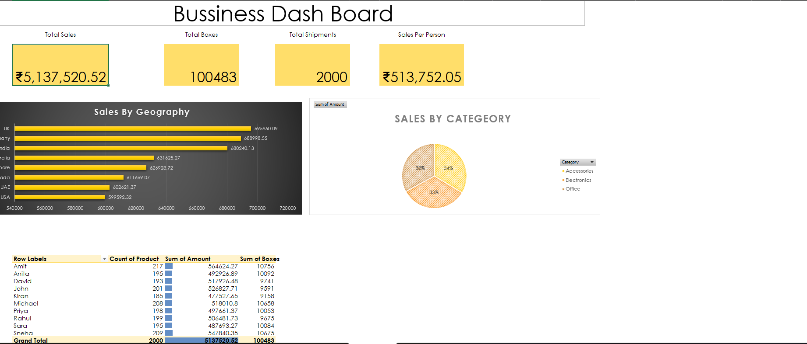

# 📊 Excel Business Dashboard

## 📌 Project Overview
This project is an interactive Business Dashboard created using Microsoft Excel. It provides insights into sales performance using charts, Pivot Tables, Pivot Charts, and Slicers.

## ✨ Features
- Total Sales Analysis
- Sales by Country
- Sales by Category
- Sales by Salesperson
- Interactive Slicers
- Pivot Tables & Pivot Charts

## 🛠️ Tools Used
- Microsoft Excel
- Pivot Tables
- Pivot Charts
- Slicers
- Conditional Formatting
- Excel Formulas

## 📂 Files
- Charan's Bussiness Dash board.xlsx

## 👨‍💻 Author
**Charan Mummineni**
## 👨‍💻 Author

**Charan Mummineni**

## 📷 Dashboard Preview

Below is a preview of the interactive Excel Business Dashboard developed using Microsoft Excel.

